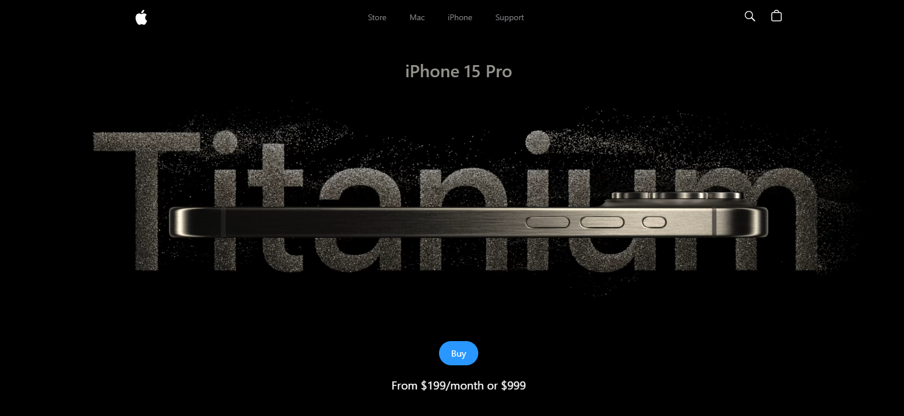

# Apple iPhone 15 📱

## Overview
This is a clone of Apple's iPhone 15 Pro website using **React.js** and **TailwindCSS**. It highlights the effective use of **GSAP (Greensock Animations)** and **Three.js** for displaying iPhone 15 Pro models in various colors and shapes.

## 🎨 Preview


## 🚀 Features
✅ Beautiful Subtle Smooth Animations using GSAP ✨🎬
Enhanced user experience with seamless and captivating animations powered by GSAP.

✅ 3D Model Rendering with Different Colors and Sizes 📱🎨
Explore the iPhone 15 Pro from every angle with dynamic 3D rendering, offering various color and size options.

✅ Custom Video Carousel (made with GSAP) 🎥🔄
Engage users with a unique and interactive video carousel developed using GSAP for a personalized browsing experience.

✅ Completely Responsive 📱💻🌍
Consistent access and optimal viewing on any device with a fully responsive design that adapts to different screen sizes.

...and many more, including code architecture and reusability! 🛠️♻️

## 🖥️ Live Demo
Check out the live version of Apple iPhone here: [Live Site](https://appleiphone-six.vercel.app/)

---

## 🤸 Quick Start

Follow these steps to set up the project locally on your machine.

**Prerequisites**

Make sure you have the following installed on your machine:

- [Git](https://git-scm.com/)
- [Node.js](https://nodejs.org/en)
- [npm](https://www.npmjs.com/) (Node Package Manager)

**Cloning the Repository**

```bash
git clone https://github.com/Sankalp20Tiwari/apple.git
cd apple
```

**Installation**

Install the project dependencies using npm:

```bash
npm install
```

**Running the Project**

```bash
npm run dev
```

Open [http://localhost:5173](http://localhost:5173) in your browser to view the project.


---

## ⚙️ Tech Stack
- React.js
- Three.js
- React Three Fiber
- React Three Drei
- GSAP (Greensock)
- Vite
- Tailwind CSS

---

## 📂 Project Structure
```
/apple
├──src/
    ├── components  # Reusable UI components
    ├──constants/   # Static data and animation file
    ├──utils/       # Utilities
    ├──App.css      # CSS file
    ├──App.jsx      # Root component
    ├──index.css    # Custom CSS
    ├──main.jsx     # Entry point
├── public          # Static assets (icons, images, etc.)
└── package.json
└── tailwind.config.ts # Config files for tailwind
```

---

## 🤝 Contributing
We welcome contributions! To contribute:
1. **Fork** the repository
2. **Create a new branch** (`git checkout -b feature-name`)
3. **Commit your changes** (`git commit -m 'Add feature'`)
4. **Push to your branch** (`git push origin feature-name`)
5. Create a **Pull Request** 🚀

---


